```mermaid
flowchart TB

%% USERS
subgraph U["Users"]
direction LR
CM["Card Members"]
M["Merchants"]
A["Analysts"]
EC["Enterprise Control Center"]
end

%% PRESENTATION
subgraph P["Presentation Layer"]
direction LR
WEB["Web Application<br/>React • Next.js"]
DASH["Analytics Dashboard"]
GRAPH["Evidence Graph UI"]
REPLAY["Courtroom Replay"]
end

%% API
subgraph API["Experience & API Gateway"]
direction LR
AUTH["Authentication<br/>OAuth2 / SSO"]
RBAC["RBAC"]
RATE["Rate Limiting"]
VALID["Request Validation"]
AUDIT["Audit Logging"]
end

%% SERVICES
subgraph S["Business Services"]
direction LR
CASE["Case Service"]
EVID["Evidence Service"]
POL["Policy Service"]
VERDICT["Verdict Service"]
ANA["Analytics Service"]
NOTIFY["Notification Service"]
end

%% EVENTS
subgraph EV["Event Processing"]
direction LR
KAFKA["Apache Kafka Event Bus"]
end

%% AI
subgraph AI["Digital Arbitration Court"]
direction LR
ORCH["Orchestrator"]

COLLECT["Evidence Collection"]

DOC["Document Intelligence"]

CUST["Customer Advocate"]

MERCHANT["Merchant Advocate"]

POLICY["Policy Intelligence"]

CASEAI["Case Intelligence"]

REASON["Reasoning Engine"]

JUDGE["Judge Agent"]

EXPLAIN["Explainability Engine"]

LEARN["Continuous Learning"]
end

%% DECISION
subgraph D["Decision Intelligence"]
direction LR
CONF["Confidence Engine"]
FAIR["Fairness Engine"]
HUMAN["Human Review"]
end

%% DATA
subgraph DATA["Knowledge Layer"]
direction LR
PG["PostgreSQL"]

NEO["Neo4j<br/>Evidence Trust Graph"]

VECTOR["pgvector"]

REDIS["Redis"]

S3["Amazon S3"]

KB["Policy Knowledge Base"]
end

%% OPS
subgraph OPS["Monitoring & Governance"]
direction LR
PROM["Prometheus"]

GRAF["Grafana"]

LOG["Audit Logs"]

SEC["Security & Compliance"]

MODEL["Model Registry"]
end

%% CLOUD
subgraph CLOUD["Cloud Platform"]
direction LR
AWS["Amazon Web Services"]
EKS["Amazon EKS"]
DOCKER["Docker"]
RDS["Amazon RDS"]
CW["CloudWatch"]
BACKUP["AWS Backup"]
end

%% OUTCOME
subgraph O["Outcomes"]
direction TB
DEC["Explainable Decision"]
REPORT["Analytics & Reporting"]
FEEDBACK["Continuous Improvement"]
end

%% FLOW

U --> P
P --> API
API --> S
S --> EV
EV --> AI
AI --> D
D --> DATA
DATA --> OPS
OPS --> CLOUD

AI --> O
D --> O
```

# Architecture Document

## Aegis Resolve AI — Digital Arbitration Court

| Field | Value |
|-------|-------|
| **Version** | MVP 0.1.0 |
| **Architecture Style** | Modular Monolith (Backend) + SPA (Frontend) |
| **Last Updated** | July 27, 2026 |

---
# Enterprise Architecture
## Aegis Resolve AI

**Version:** 1.0  
**Architecture Style:** Cloud-Native Event-Driven Microservices with Explainable Multi-Agent AI

---

# Overview

Aegis Resolve AI is an enterprise-grade dispute resolution platform that combines cloud-native microservices, event-driven architecture, and explainable multi-agent artificial intelligence to automate payment dispute investigations while maintaining fairness, transparency, and regulatory compliance.

Unlike traditional rule-based workflows, the platform orchestrates specialized AI agents that collaborate over a shared Evidence Trust Graph before generating an explainable decision.

---

# Enterprise Architecture



---

# Architecture Layers

## 1. Users

The platform supports multiple stakeholders.

- Card Members
- Merchants
- Analysts
- Enterprise Operations

---

## 2. Presentation Layer

Provides enterprise user interfaces.

Components

- Customer Portal
- Merchant Portal
- Analytics Dashboard
- Evidence Graph Viewer
- Courtroom Replay

---

## 3. Experience Gateway

Provides secure platform access.

Responsibilities

- Authentication
- Authorization
- Request Validation
- Rate Limiting
- Audit Logging

---

## 4. Business Services

Domain-driven microservices.

- Case Management
- Evidence Processing
- Policy Service
- Decision Service
- Notification Service
- Analytics

---

## 5. Event Processing

Apache Kafka coordinates asynchronous communication between services and AI agents.

Benefits

- Loose coupling
- Scalability
- Reliability
- Fault isolation

---

## 6. Digital Arbitration Court

The platform's intelligence layer.

Specialized AI agents collaborate instead of relying on a single LLM.

Agents include:

- Evidence Collection
- Document Intelligence
- Customer Advocate
- Merchant Advocate
- Policy Intelligence
- Case Intelligence
- Reasoning Engine
- Judge Agent
- Explainability Engine
- Continuous Learning

---

## 7. Decision Intelligence

Before a verdict is issued:

- Confidence Engine validates certainty.
- Fairness Engine checks policy consistency.
- Human Review handles exceptional cases.

---

## 8. Knowledge Layer

Enterprise knowledge is stored across specialized systems.

| Component | Purpose |
|-----------|---------|
| PostgreSQL | Transactional data |
| Neo4j | Evidence Trust Graph |
| pgvector | Semantic retrieval |
| Redis | Low-latency cache |
| Amazon S3 | Documents |
| Policy Knowledge Base | Rules & compliance |

---

## 9. Monitoring & Governance

Operational visibility.

- Prometheus
- Grafana
- Audit Logs
- Security Monitoring
- Model Governance

---

## 10. Cloud Platform

Cloud-native deployment.

- AWS
- Docker
- Amazon EKS
- Amazon RDS
- CloudWatch
- Backup & Disaster Recovery

---

# Request Lifecycle

1. A dispute is submitted.
2. Evidence is collected from enterprise systems.
3. The Evidence Trust Graph links related entities.
4. AI agents independently analyze the dispute.
5. The Judge Agent synthesizes findings.
6. Confidence and Fairness Engines validate the recommendation.
7. Human review is triggered when required.
8. An explainable decision is issued.
9. Case outcomes improve future models through continuous learning.

---

# Enterprise Characteristics

- Cloud Native
- Event Driven
- Explainable AI
- Multi-Agent Reasoning
- Human-in-the-Loop
- Policy Aware
- Horizontally Scalable
- Highly Available
- Secure by Design
- Fully Auditable

---

# Conclusion

Aegis Resolve AI combines cloud-native architecture, explainable multi-agent intelligence, and enterprise governance into a unified dispute resolution platform capable of delivering faster, fairer, and more transparent payment dispute decisions at production scale.
## 1. Architecture Overview

Aegis Resolve AI follows a **three-tier architecture** optimized for demo reliability and future production scaling:

```
┌─────────────────────────────────────────────────────────────┐
│                    Presentation Layer                        │
│         Next.js 16 · React 19 · Tailwind CSS 4              │
│   Landing │ Customer Portal │ Merchant Portal │ Control Ctr │
└──────────────────────────┬──────────────────────────────────┘
                           │ REST + WebSocket (HTTP)
┌──────────────────────────▼──────────────────────────────────┐
│                    Application Layer                         │
│              FastAPI 0.115 · Python 3.12                     │
│   Disputes │ Evidence │ Verdicts │ Analytics │ Replay       │
└──────────────────────────┬──────────────────────────────────┘
                           │ SQLite driver
┌──────────────────────────▼──────────────────────────────────┐
│                      Data Layer                              │
│           SQLite (aegis_resolve.db) — JSON documents         │
└─────────────────────────────────────────────────────────────┘
```

---

## 2. Architectural Principles

| Principle | Implementation |
|-----------|----------------|
| **Single source of truth** | One dispute record shared across all three portals |
| **Explainability by design** | Every verdict includes policy citation, confidence, fairness, and replay |
| **Graceful degradation** | Frontend ships fallback demo data if API is unreachable |
| **Demo-first simplicity** | Monolithic backend, document-store persistence, deterministic outcomes |
| **Future-ready boundaries** | Empty `agents/`, `core/`, `models/` folders for modularization |

---

## 3. Component Architecture

### 3.1 Frontend Components

```
frontend/src/
├── app/
│   ├── page.tsx                    # Landing / marketing
│   ├── layout.tsx                  # Global nav, header, footer
│   ├── customer/
│   │   ├── page.tsx                # Card member dashboard
│   │   ├── file-dispute/page.tsx   # 3-step dispute form
│   │   └── disputes/[id]/page.tsx  # Case detail
│   ├── merchant/
│   │   ├── page.tsx                # Merchant dashboard
│   │   └── cases/[id]/page.tsx     # Merchant case response
│   └── admin/
│       ├── page.tsx                # Enterprise control center
│       └── cases/[id]/page.tsx     # Courtroom dossier
├── components/
│   ├── dispute-views.tsx           # Shared portal UI (primary)
│   └── ui/                         # Button, Card, Badge primitives
└── lib/
    ├── api.ts                      # API client helpers
    └── utils.ts                    # Tailwind merge utilities
```

**Key design decision:** `dispute-views.tsx` centralizes all portal dashboards and case detail rendering, parameterized by audience (`customer`, `merchant`, `admin`).

### 3.2 Backend Components

```
backend/
├── main.py                 # Entire API: models, DB, seed, endpoints
├── requirements.txt        # Python dependencies
├── Dockerfile              # Container image
├── aegis_resolve.db        # Runtime SQLite database
├── agents/                 # (Planned) Agent microservices
├── core/                   # (Planned) Business logic extraction
├── data/                   # (Planned) Data access layer
└── models/                 # (Planned) Pydantic model modules
```

**Current state:** All logic lives in `main.py` (~275 lines). Empty module folders signal intended future decomposition.

---

## 4. Data Architecture

### 4.1 Storage Model

SQLite table with JSON document pattern:

```sql
CREATE TABLE disputes (
    id TEXT PRIMARY KEY,
    payload TEXT NOT NULL  -- Full Dispute JSON serialized
);
```

**Rationale:** Rapid MVP development without schema migrations. Each dispute is a self-contained document with nested evidence, verdict, and events arrays.

### 4.2 Core Entities

```
Dispute
├── id, title, card_member, merchant
├── amount, currency, reason_code, reason
├── status (open | processing | resolved | human_review)
├── created_at, deadline
├── evidence[] → Evidence
├── verdict? → Verdict
└── events[] → ReplayEvent

Evidence
├── id, type, title, source
├── trust (0-100)
├── relation (confirms | contradicts | supplements)
└── detail

Verdict
├── outcome (card_member | merchant | human_review)
├── confidence, fairness (0-100)
├── headline, explanation
└── policy_code, policy_title
```

### 4.3 Seed Strategy

On first boot, if the database is empty, five demo cases are inserted via `seeded_disputes()`. Each case includes pre-built evidence, verdicts, and replay events.

---

## 5. API Architecture

### 5.1 REST Endpoints

| Resource | Methods | Purpose |
|----------|---------|---------|
| `/health` | GET | Service health |
| `/v1/disputes` | GET, POST | List / create disputes |
| `/v1/disputes/{id}` | GET | Single dispute |
| `/v1/disputes/{id}/evidence` | POST | Append evidence |
| `/v1/disputes/{id}/process` | POST | Run policy engine |
| `/v1/disputes/{id}/verdict` | GET | Get verdict |
| `/v1/disputes/{id}/evidence-graph` | GET | Graph nodes/edges |
| `/v1/disputes/{id}/replay` | GET | Courtroom replay events |
| `/v1/disputes/{id}/override` | POST | Analyst override |
| `/v1/analytics/control-center` | GET | KPI dashboard |
| `/v1/analytics/fairness` | GET | Fairness distribution |

### 5.2 WebSocket

`WS /v1/disputes/{id}/stream` — Streams replay events sequentially, then closes. Enables real-time courtroom replay visualization (frontend wiring planned).

### 5.3 Policy Engine

Deterministic lookup against `POLICIES` dictionary keyed by AMEX reason code. `process_dispute()` applies policy text and routes new cases to `human_review` with fixed confidence/fairness scores.

---

## 6. Agent Pipeline (Conceptual)

The MVP does not run separate agent services. Instead, `build_events()` generates a narrative timeline representing the target architecture:

```
Orchestrator
    ↓
Evidence Collection Agent
    ↓
Document Intelligence Agent
    ↓
Customer & Merchant Advocates (parallel)
    ↓
Policy & Compliance Agent
    ↓
Financial Risk & Fairness Engine
    ↓
Neutral Judge Agent
    ↓
Explainability & Audit Agents
    ↓
Operations Analyst (on override)
```

**Production target:** Each agent becomes an independent service orchestrated via LangGraph with an approved LLM provider.

---

## 7. Cross-Cutting Concerns

### 7.1 CORS

Backend allows `http://localhost:3000` only — sufficient for local demo.

### 7.2 Error Handling

- 404 for missing disputes
- 409 for verdict-not-ready conflicts
- Frontend fallback to hardcoded cases on network failure

### 7.3 Validation

Pydantic models enforce:
- Trust/confidence/fairness: 0–100 range
- Amount: must be > 0
- Outcome/relation/status: literal type constraints

---

## 8. Deployment Architecture

### 8.1 Local Development

```
Terminal 1: uvicorn main:app --reload --port 8000  (backend)
Terminal 2: npm run dev                             (frontend :3000)
```

### 8.2 Docker Compose

```yaml
services:
  backend:  python:3.12-slim → port 8000
  frontend: node:22           → port 3000
```

Environment variables via `.env`:
- `NEXT_PUBLIC_API_URL=http://localhost:8000/v1`
- `AEGIS_ENV=development`

---

## 9. Production Evolution Roadmap

| Current (MVP) | Target (Production) |
|---------------|---------------------|
| SQLite JSON store | PostgreSQL with normalized schema |
| Monolithic `main.py` | Agent microservices in `backend/agents/` |
| Deterministic policy | LLM-assisted reasoning with guardrails |
| No authentication | OAuth2 / SSO with RBAC |
| In-memory replay events | Immutable append-only audit event store |
| Static policy dict | Version-controlled policy definitions |
| localhost CORS | Tenant-scoped API gateway |

---

## 10. Quality Attributes

| Attribute | MVP Approach | Production Target |
|-----------|--------------|-------------------|
| **Scalability** | Single-process, SQLite | Horizontal pods + PostgreSQL |
| **Maintainability** | Monolith, inline models | Modular packages, OpenAPI codegen |
| **Testability** | Manual demo + Swagger | Unit/integration/e2e test suite |
| **Observability** | FastAPI auto-docs | Structured logging, tracing, metrics |
| **Security** | Localhost only | AuthN/AuthZ, encryption at rest |

---

*End of Architecture Document*
