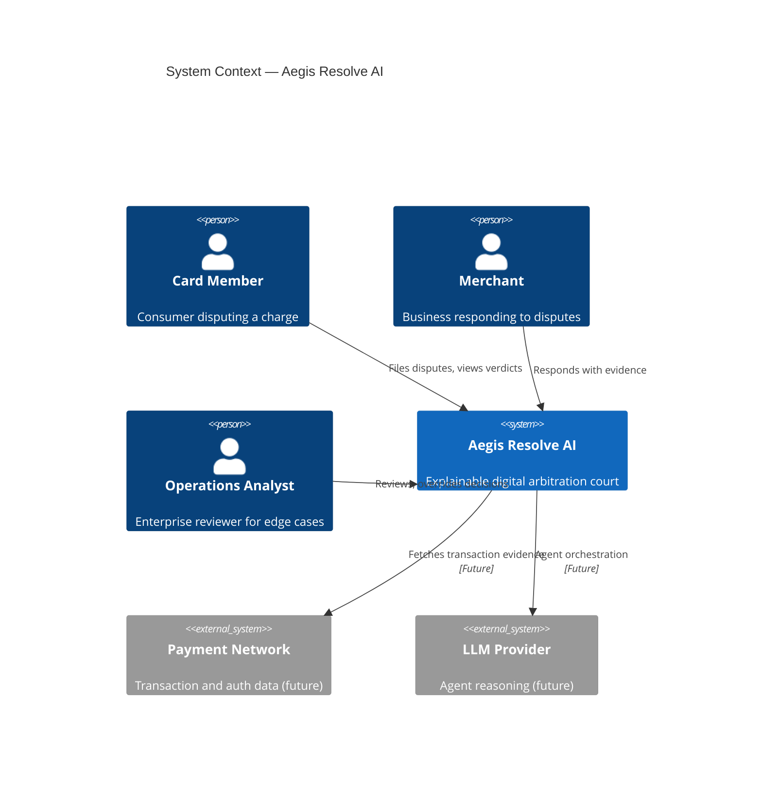
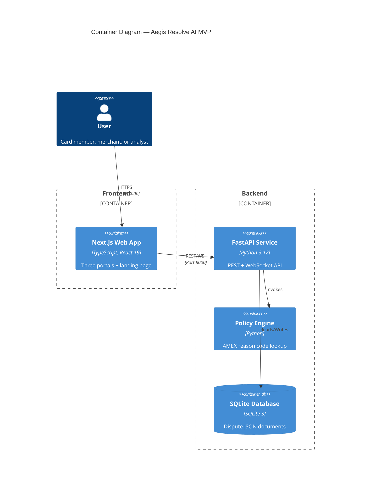
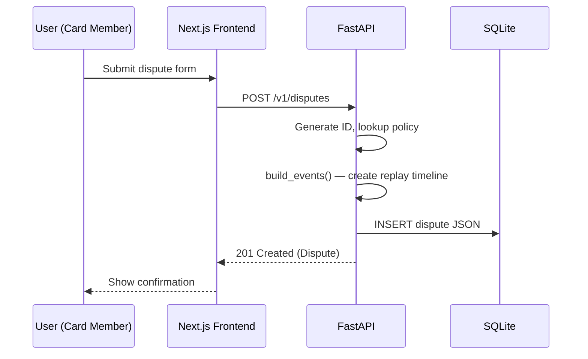
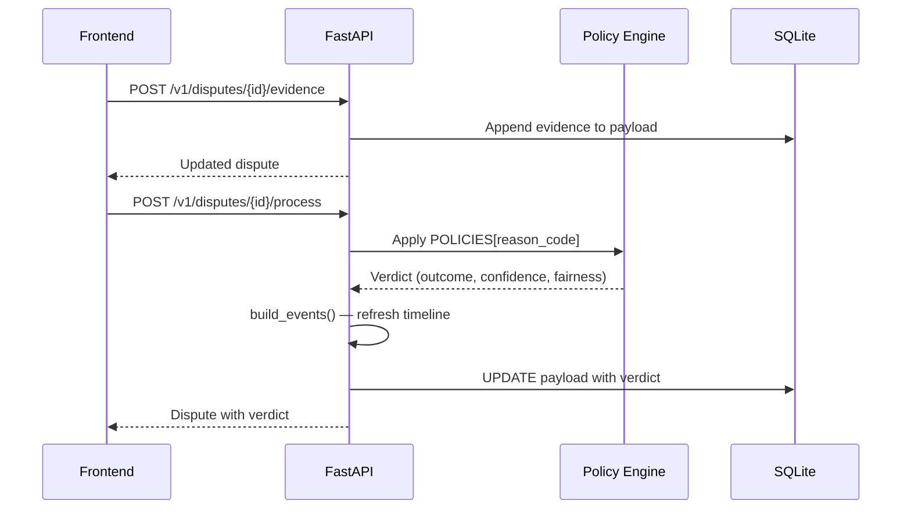
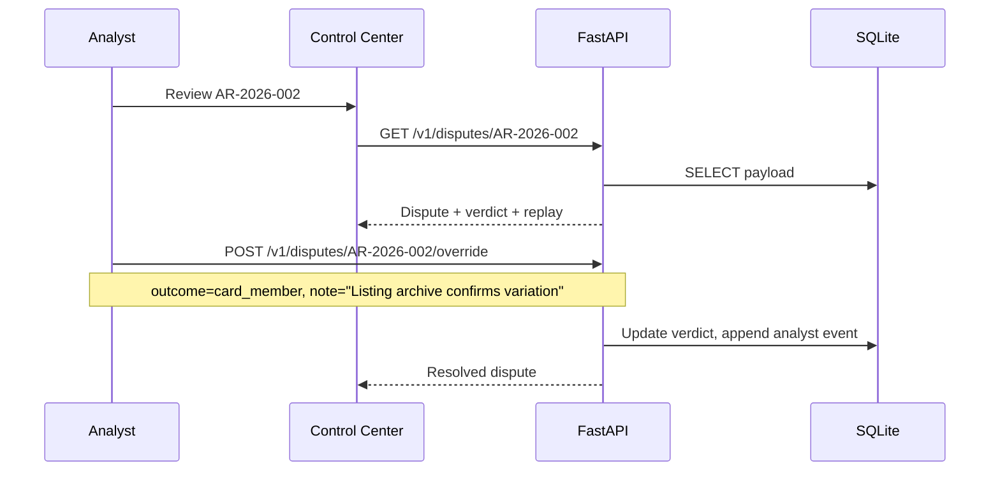
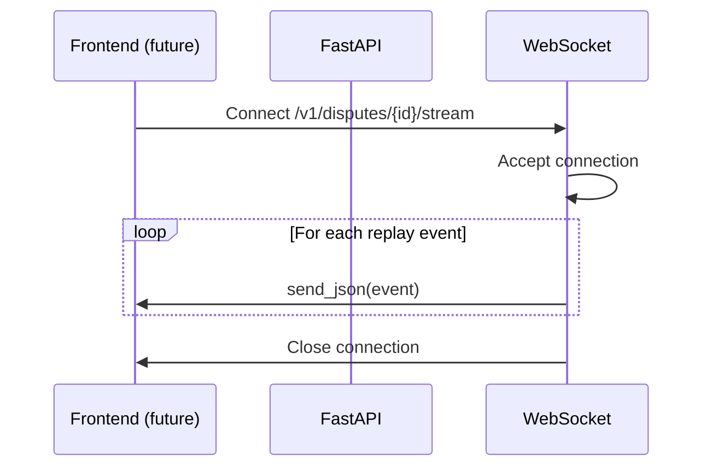

# System Architecture

## Aegis Resolve AI — Digital Arbitration Court

| Field | Value |
|-------|-------|
| **Document Type** | System Architecture Specification |
| **Version** | MVP 0.1.0 |
| **Last Updated** | July 27, 2026 |

---

## 1. System Context

Aegis Resolve AI operates as a dispute-resolution platform connecting three stakeholder groups to a centralized arbitration engine.



---

## 2. Container Diagram



---

## 3. System Boundaries

### 3.1 Internal Systems

| System | Responsibility |
|--------|----------------|
| **Next.js Frontend** | User interface for all three portals |
| **FastAPI Backend** | Business logic, API, persistence |
| **SQLite Database** | Dispute document storage |
| **Policy Engine** | Reason-code-based verdict generation |

### 3.2 External Systems (Future)

| System | Integration Point | Status |
|--------|-------------------|--------|
| Payment Network (Amex/Visa/MC) | Transaction evidence ingestion | Not implemented |
| LLM Provider (OpenAI/Anthropic) | Agent reasoning | Not implemented |
| Identity Provider (OAuth/OIDC) | Authentication | Not implemented |
| Object Storage (S3) | Evidence file uploads | Not implemented |
| Message Queue (Kafka/SQS) | Async agent pipeline | Not implemented |

---

## 4. Data Flow

### 4.1 Dispute Creation Flow



### 4.2 Dispute Processing Flow



### 4.3 Analyst Override Flow



### 4.4 Real-Time Replay Stream



---

## 5. Portal Architecture

All three portals consume the same backend API but present role-specific views:

```
                    ┌─────────────────┐
                    │  Shared API     │
                    │  /v1/disputes   │
                    └────────┬────────┘
                             │
           ┌─────────────────┼─────────────────┐
           │                 │                 │
    ┌──────▼──────┐   ┌──────▼──────┐   ┌──────▼──────┐
    │  Customer   │   │  Merchant   │   │   Admin     │
    │  Portal     │   │  Portal     │   │  Control    │
    │  /customer  │   │  /merchant  │   │  /admin     │
    └─────────────┘   └─────────────┘   └─────────────┘
    │ Active cases  │   │ Incoming    │   │ Review queue│
    │ File dispute  │   │ cases       │   │ KPI metrics │
    │ Case detail   │   │ Respond     │   │ Dossier     │
    └───────────────┘   └─────────────┘   └─────────────┘
```

**Implementation:** `dispute-views.tsx` accepts an `audience` prop to toggle labels, metrics, and action buttons.

---

## 6. Evidence Trust Graph

The evidence trust graph models relationships between case evidence items:

```
                    ┌──────────────┐
                    │    Case      │
                    │  (trust:100) │
                    └──────┬───────┘
           ┌───────────────┼───────────────┐
           │               │               │
    ┌──────▼──────┐ ┌──────▼──────┐ ┌──────▼──────┐
    │ Transaction │ │  Shipment   │ │Communication│
    │ trust: 100  │ │  trust: 96  │ │  trust: 76  │
    │  confirms   │ │  confirms   │ │ supplements │
    └─────────────┘ └─────────────┘ └─────────────┘
```

**API endpoint:** `GET /v1/disputes/{id}/evidence-graph` returns `{ nodes[], edges[] }` suitable for graph visualization libraries.

---

## 7. Security Architecture (MVP vs Production)

### MVP (Current)

| Layer | Control |
|-------|---------|
| Network | localhost only |
| CORS | `http://localhost:3000` |
| Authentication | None |
| Authorization | None |
| Data encryption | None (local SQLite) |

### Production (Target)

| Layer | Control |
|-------|---------|
| Network | HTTPS via API gateway |
| CORS | Tenant-scoped origins |
| Authentication | OAuth2 / OIDC SSO |
| Authorization | RBAC (card_member, merchant, analyst, admin) |
| Data encryption | TLS in transit, AES-256 at rest |
| Audit | Immutable append-only event log |
| Tenant isolation | Row-level security in PostgreSQL |

---

## 8. Scalability Model

### MVP Capacity

- Single Uvicorn worker
- SQLite file lock (single writer)
- ~5 seeded cases, suitable for demo load

### Production Scaling Path

```
                    ┌─────────────┐
                    │ Load Balancer│
                    └──────┬──────┘
              ┌────────────┼────────────┐
        ┌─────▼─────┐ ┌─────▼─────┐ ┌─────▼─────┐
        │ API Pod 1 │ │ API Pod 2 │ │ API Pod N │
        └─────┬─────┘ └─────┬─────┘ └─────┬─────┘
              └─────────────┼─────────────┘
                    ┌───────▼───────┐
                    │  PostgreSQL   │
                    │  (Primary)    │
                    └───────┬───────┘
                    ┌───────▼───────┐
                    │  Read Replica │
                    └───────────────┘
```

Agent pipeline scales independently via message queue workers.

---

## 9. Monitoring & Observability (Production Target)

| Signal | Tool (Planned) | Purpose |
|--------|----------------|---------|
| **Logs** | Structured JSON → ELK/Datadog | Request tracing, error diagnosis |
| **Metrics** | Prometheus + Grafana | API latency, dispute throughput |
| **Traces** | OpenTelemetry | End-to-end dispute lifecycle |
| **Alerts** | PagerDuty | Human-review queue SLA breaches |
| **Audit** | Immutable event store | Compliance replay |

---

## 10. Disaster Recovery (Production Target)

| Scenario | Strategy |
|----------|----------|
| Database failure | PostgreSQL streaming replication + daily backups |
| API pod crash | Kubernetes auto-restart + health checks |
| Region outage | Multi-AZ deployment |
| Data corruption | Point-in-time recovery from audit event store |

---

## 11. Integration Points Summary

| Integration | Protocol | Direction | Status |
|-------------|----------|-----------|--------|
| Frontend ↔ Backend | REST (JSON) | Bidirectional | ✅ Active |
| Frontend ↔ Backend | WebSocket (JSON) | Server → Client | ✅ API ready |
| Backend ↔ SQLite | SQL | Bidirectional | ✅ Active |
| Backend ↔ Payment Network | REST/gRPC | Inbound | 🔲 Future |
| Backend ↔ LLM Provider | REST | Outbound | 🔲 Future |
| Backend ↔ Auth Provider | OIDC | Bidirectional | 🔲 Future |

---

*End of System Architecture Document*
